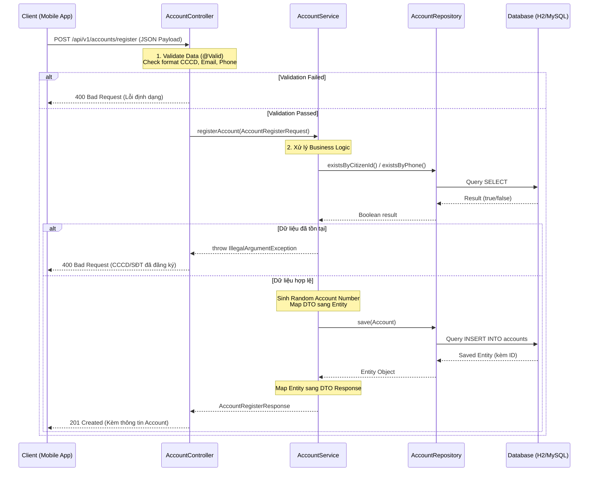

# Sơ đồ kiến trúc xử lý API eKYC (Spring Boot 3 Lớp)

Dưới đây là sơ đồ Mermaid mô tả luồng đi của dữ liệu từ Client (Mobile App) qua các tầng kiến trúc (Controller -> Service -> Repository) tới Database và trả kết quả về.

